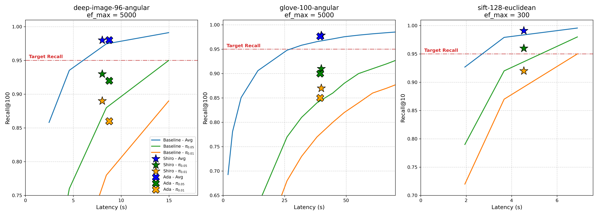

# HNSW Shiro EF (Adaptive EF)

This repository implements an **Adaptive `ef` (exploration factor) search mechanism** for HNSW (Hierarchical Navigable Small World) graphs. The goal of this system is to dynamically predict and optimize the `ef` parameter per-query to strictly satisfy a target recall constraint while minimizing the total number of distance computations.

## How it Works

The `hnsw-shiro-ef` (SHIRO-EF) system augments the standard HNSW search algorithm with dynamic thresholding based on local neighborhood density and query difficulty estimation.

Instead of applying a globally fixed `ef` parameter, the system uses:
1. **Cross-Validation (CV) Tables**: To estimate the relationship between approximate distance scores and the required `ef` for the target recall. The dataset is chunked into `n_cv_tables` (default: 15) to calculate out-of-fold statistics, preventing overfitting to the training queries.
2. **Score Calibrator / Estimator**: Analyzes query difficulty and predicts a safe upper bound.
3. **Outlier Filtering (`min_q`)**: By requiring a minimum number of queries per score threshold (`min_q = 3`), the system filters out statistical anomalies and stabilizes the adaptive predictions.
4. **Adaptive Scaling Parameters (`alpha` and `gamma`)**: Allow fine-tuning of the prediction confidence interval and error tolerance limits.

## Project Structure

- `hnswlib/`: The core header-only C++ library, extending standard HNSW with Adaptive EF (`adaptive_ef.h`, `estimator.h`, `sketch.h`).
- `experiments_driver/`: Contains the benchmarking and evaluation harness (`run.cpp`), simulating searches on various datasets and logging the Adaptive EF improvements vs. static EF.
- `research/`: Python scripts and Jupyter notebooks for generating plots, sweeping EF hyperparameters (`ef_sweep`), and performing ablation studies on `gamma` and `n_cv_tables`.

## Building the Project

The project uses CMake and requires a modern C++ compiler supporting C++11/C++14 along with OpenMP for multithreading.

```bash
mkdir build
cd build
cmake -DCMAKE_BUILD_TYPE=Release ..
make -j$(nproc)
```

## Running Experiments

The benchmarking suite is driven by `experiments_driver/run.cpp`. You can execute it directly after building:

```bash
./build/run
```

To capture the output logs for further analysis:
```bash
./build/run > output_shiro.log
```

*Note: The datasets to be evaluated are configured in the `g_experiments` list inside `run.cpp`. By default, it runs benchmarks on `sift-128-euclidean`, `deep-image-96-angular`, and `glove-100-angular`.*

## Parameter Configuration Deep-Dive

The HNSW Shiro EF system is heavily parameterized to allow fine-grained control over query-time estimation, caching sizes, and outlier resilience. These configuration values are centrally located in the `ExperimentConfig` struct (specifically in `g_experiments` within `experiments_driver/run.cpp`). 

Here is a detailed breakdown of every configuration parameter in the benchmarking pipeline:

### 1. Dataset & Task Definition
*   **`dataset`** (`string`): The name of the target dataset (e.g., `"sift-128-euclidean"`, `"deep-image-96-angular"`, `"glove-100-angular"`). The code expects corresponding pre-processed index files or HDF5 structures.
*   **`metric`** (`string`): Distance metric space used by the dataset. 
    *   `l2` (Euclidean distance).
    *   `cd` / `ip` (Cosine distance / Inner Product).
*   **`k`** (`size_t`): Target number of nearest neighbors to retrieve (typically `100` or `1000`).
*   **`expected_recall`** (`float`): The target recall rate the adaptive algorithm is strictly required to satisfy (e.g., `0.95f` meaning 95%). The adaptive scaling mechanisms will aim to hit this recall exactly without overshooting, conserving computational budget.

### 2. Adaptive EF Scaling Parameters
*   **`alpha`** (`float`): Scaling weight (e.g., `0.25f`) used inside the dynamic score estimator. It controls how tightly the adaptive mechanism binds the search threshold to the predicted query complexity. A higher alpha demands a wider margin of safety, increasing `ef` dynamically.
*   **`gamma`** (`float`): Calibration parameter (e.g., `12.0f`) managing the exponential/logarithmic decay of score distributions. It directly controls error tolerance thresholds across varying density regions of the dataset.

### 3. HNSW and Computational Bounds
*   **`ef_upper_bound`** (`int`): The hard safety maximum allowed for the dynamically predicted `ef` value. Ensures worst-case queries do not cause catastrophic tail-latencies. For datasets like SIFT, `300` is common; for harder datasets like deep-image, it can safely go up to `5000`.
*   **`statics_length`** (`size_t`): Defines the internal memory length (e.g., `1 + 32 + 31 * 32`) representing the size of the pre-computed static lookup tables utilized by the HNSW search bound approximator to execute faster at query-time.

### 4. Cross-Validation & Outlier Resilience (Shiro EF Core)
*   **`n_cv_tables`** (`int`): Number of cross-validation chunks/partitions used during calibration (default **`15`**). The system chunks the data and uses "out-of-fold" validation to determine distance score mappings. Using 15 chunks prevents overfitting to localized high-density regions inside the indexing structure.
*   **`sampling_size`** (`int`): Number of ground-truth query samples used dynamically to prime and pre-generate the cross-validation score lookup tables (e.g., `3000`).
*   **`min_queries_per_score` / `min_q`** (`int`): Frequency threshold constraint (default **`3`**). A specific predicted distance score bracket must contain at least 3 queries during calibration to be considered statistically valid. It trims single-query outlier noise, stabilizing the final boundary estimators.
*   **`repeat`** (`int`): Number of full passes the driver simulates (e.g., `3`) to ensure benchmark timing and latency distributions are robust against OS jitter.

## Result Demonstration

The plot below demonstrates the final visualization of the adaptive queries, showcasing the improved query-time efficiency frontiers versus traditional static HNSW.


