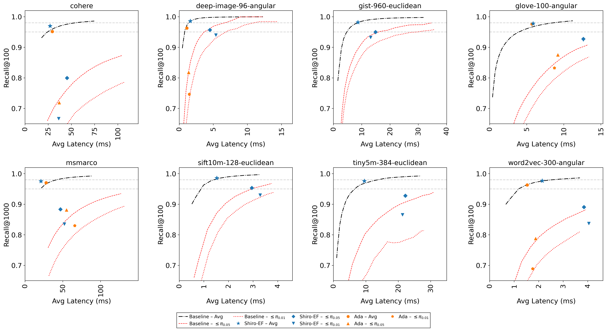

# HNSW Shiro EF

This repository implements an **Shiro `ef` (exploration factor) search mechanism** for HNSW (Hierarchical Navigable Small World) graphs. The goal of this system is to dynamically predict and optimize the `ef` parameter per-query to strictly satisfy a target recall constraint while minimizing the total number of distance computations.

## How it Works

The `hnsw-shiro-ef` (SHIRO-EF) system augments the standard HNSW search algorithm with dynamic thresholding based on local neighborhood density and query difficulty estimation.

Instead of applying a globally fixed `ef` parameter, the system operates through a specialized scoring and mapping pipeline:

## Project Structure

- `hnswlib/`: The core header-only C++ library, extending standard HNSW with Adaptive EF (`adaptive_ef.h`, `estimator.h`, `sketch.h`). The `estimator.h` contains the `ApproximatedScoreCalculator` logic.
- `experiments_driver/`: Contains the benchmarking and evaluation harness (`run.cpp`), simulating searches on various datasets and logging the Adaptive EF improvements vs. static EF.
- `research/`: Python scripts dedicated to evaluation, visualization, and ablation studies:
   - **`final_plot.py`**: Parses the driver logs to plot the final QPS vs. Recall frontiers, comparing Adaptive EF against baseline static HNSW.
   - **`visualize_ef_map.py`**: Parses binary debug dumps to visualize the internal correlation between the estimator's Revisit Rank score and the dynamically predicted `ef` value.
   - **`ablation_hops.py` / `ablation_plot.py`**: Scripts to analyze how different visited list sizes (1.5-hop, 2-hop, 3-hop) and sampling sizes affect latency and prediction accuracy.
   - **`compare_sampling.py`**: Compares the benchmark results between different dataset sampling configurations.
   - **`convert_fvecs_to_hdf5.py`**: A dedicated utility to parse binary `.fvecs` and `.ivecs` files into `.hdf5` formats ready for the C++ harness.

## Dependencies

To compile and run the project, ensure the following system-level dependencies are installed:

### C++ Core Dependencies

- **CMake** (v3.10+ recommended) for the build system.
- **C++ Compiler** (GCC/Clang) with `C++11/14` and **OpenMP** support enabled for multithreading.
- **Eigen3**: Used extensively in `util.h` for matrix and vector representations of datasets.
- **Boost**: Required for internal project utilities.
- **HDF5 (with C++ bindings)**: Used by `experiments_driver/util.h` via `<H5Cpp.h>` to read and write dataset structures. On Ubuntu, this is typically provided by `libhdf5-dev` and `libhdf5-cpp-11` (or similar).

### Python Dependencies (Optional, for `research/`)

If you plan to run the analysis scripts or convert datasets, you will need:

- **`numpy`** and **`matplotlib`**: For log parsing and rendering visual plots (`final_plot.py`, `ablation_plot.py`).
- **`h5py`**: For running format conversion utilities.

## Building the Project

The project uses CMake and requires a modern C++ compiler supporting C++11/C++14 along with OpenMP for multithreading.

```bash
mkdir build
cd build
cmake -DCMAKE_BUILD_TYPE=Release ..
make -j$(nproc)
```

## Dataset and Index Management

### Directory Structure Requirements

Before running the experiments, you need to ensure the correct directory structure is in place at the root of the project. The experimental driver (`experiments_driver/run.cpp`) expects data to be located in specific folders:

1. **`data/`**: This is where your dataset files must be placed.
2. **`index/`**: This is where the pre-built HNSW graph indices (`.bin` files) will be loaded from or automatically saved to.

Make sure to create these directories in your project root before running the benchmark:

```bash
mkdir data
mkdir index
```

Or make when by running the shell script:

```bash
./setup.sh
```

### Loading Datasets (HDF5 and FVECS)

The core driver strictly loads datasets packaged in the **HDF5** format to support robust matrix operations.

- **If you have an `.hdf5` dataset**:
  Simply place the file into the `data/` directory. Ensure the filename perfectly matches the dataset name defined in the `g_experiments` array inside `run.cpp` (e.g., if the dataset name is `"sift10m-128-euclidean"`, place the file at `data/glove-100-angular.hdf5`). The HDF5 file should contain the base vectors, query vectors, and ground truth data.

- **If you have `.fvecs` / `.ivecs` datasets (e.g., raw SIFT/GIST)**:
  The C++ benchmarking harness does not natively parse raw `.fvecs` binaries at runtime. You must pre-process and convert these `.fvecs` datasets into a unified `.hdf5` file first. You can use the provided pythom script `research/convert_fvecs_to_hdf5.py` to read your raw `.fvecs` base, query, and ground-truth `.ivecs` files and package them correctly into the required `.hdf5` format. Once converted, move the resulting `.hdf5` file into the `data/` directory.

### Building the Index for the First Time

You do not need to compile or run a separate tool to build the HNSW index. The benchmarking harness handles this automatically!

1. **Ensure the data is present**: Place your prepared dataset (e.g., `data/sift10m-128-euclidean.hdf5`) into the `data/` folder.
2. **Run the driver**: Uncomment `index_exp()` and execute `./build/run`.
3. **Automatic Build Process**:
   - The driver will check the `index/` folder for a matching `.bin` file (e.g., `index/sift10m-128-euclidean.bin`).
   - **If the `.bin` file is missing**, the system detects that it's the first time running this dataset.
   - It will automatically invoke the index-building routine using the parameters defined in the code (typically `M=16`, `ef_construction=500`).
   - The building phase will utilize all available CPU cores. Once completed, it will save the serialized graph to the `index/` folder.
   - Subsequent runs of `./build/run` will detect the `.bin` file and skip the lengthy build process, instantly loading the index into memory for benchmarking.

## Running Experiments

The benchmarking suite is driven by `experiments_driver/run.cpp`. You can execute it directly after building:

```bash
./build/run
```

To capture the output logs for reproducing data and further analysis:

```bash
./build/run > output_shiro.log
```

_Note: The datasets to be evaluated are configured in the `g_experiments` list inside `run.cpp`._

## Parameter Configuration Deep-Dive

The HNSW Shiro EF system is heavily parameterized to allow fine-grained control over query-time estimation, caching sizes, and outlier resilience. These configuration values are centrally located in the `ExperimentConfig` struct (specifically in `g_experiments` within `experiments_driver/run.cpp`).

Here is a detailed breakdown of every configuration parameter in the benchmarking pipeline:

### 1. Dataset & Task Definition

- **`dataset`** (`string`): The name of the target dataset (e.g., `"sift-128-euclidean"`, `"deep-image-96-angular"`, `"glove-100-angular"`). The code expects corresponding pre-processed index files or HDF5 structures.
- **`metric`** (`string`): Distance metric space used by the dataset.
   - `l2` (Euclidean distance).
   - `cd` / `ip` (Cosine distance / Inner Product).
- **`k`** (`size_t`): Target number of nearest neighbors to retrieve (typically `100` or `1000`).
- **`expected_recall`** (`float`): The target recall rate the adaptive algorithm is strictly required to satisfy (e.g., `0.95f` meaning 95%). The adaptive scaling mechanisms will aim to hit this recall exactly without overshooting, conserving computational budget.

### 2. Adaptive EF Scaling Parameters

- **`alpha`** (`float`): Scaling weight (e.g., `0.25f`) used inside the dynamic score estimator. It controls how tightly the adaptive mechanism binds the search threshold to the predicted query complexity. A higher alpha demands a wider margin of safety, increasing `ef` dynamically.
- **`gamma`** (`float`): Calibration parameter (e.g., `12.0f`) managing the exponential/logarithmic decay of score distributions. It directly controls error tolerance thresholds across varying density regions of the dataset.

### 3. HNSW and Computational Bounds

- **`ef_upper_bound`** (`int`): The hard safety maximum allowed for the dynamically predicted `ef` value. Ensures worst-case queries do not cause catastrophic tail-latencies. For datasets like SIFT, `300` is common; for harder datasets like deep-image, it can safely go up to `5000`.
- **`statics_length`** (`size_t`): Defines the internal memory length (e.g., `1 + 32 + 31 * 32`) representing the size of the pre-computed static lookup tables utilized by the HNSW search bound approximator to execute faster at query-time.

### 4. Cross-Validation & Outlier Resilience (Shiro EF Core)

- **`n_convergence_buckets`** (`int`): Number of cross-validation chunks/partitions used during calibration (default **`15`**). The system chunks the data and uses "out-of-fold" validation to determine distance score mappings. Using 15 chunks prevents overfitting to localized high-density regions inside the indexing structure.
- **`sampling_size`** (`int`): Number of ground-truth query samples used dynamically to prime and pre-generate the cross-validation score lookup tables (e.g., `3000`).
- **`min_queries_per_score` / `min_q`** (`int`): Frequency threshold constraint (default **`3`**). A specific predicted distance score bracket must contain at least 3 queries during calibration to be considered statistically valid. It trims single-query outlier noise, stabilizing the final boundary estimators.
- **`repeat`** (`int`): Number of full passes the driver simulates (e.g., `3`) to ensure benchmark timing and latency distributions are robust against OS jitter.

## Result Demonstration

The plot below demonstrates the final visualization of the adaptive queries, showcasing the improved query-time efficiency frontiers versus traditional static HNSW.


